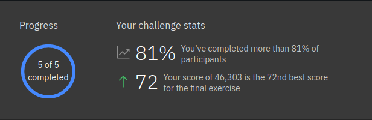
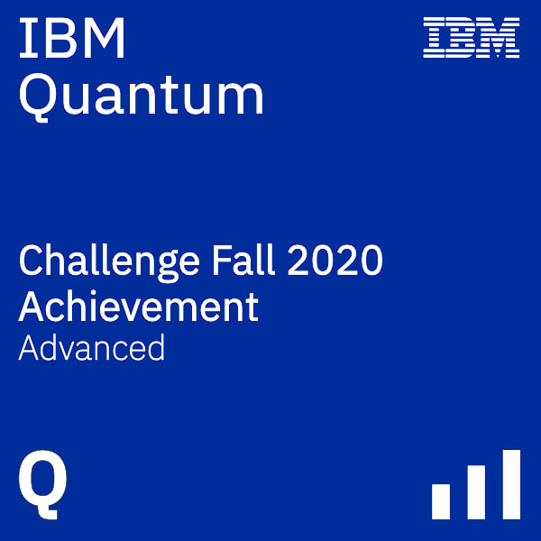

<!-- -->
# Solution to IBM Quantum Challenge 2020!

Starting Nov 9th at 9am JST, IBM Quantum Challenge 2020 consisted of three weeks of challenges which involved implementing complex quantum data structures using qRAM and designing a quantum game solver using Grover’s algorithm.

Of the 2,000 participants, 1,091 were able to solve at least one of the first week’s exercises, 576 were able to solve at least one of the second week’s exercises, and 227 were able to successfully solve all of the exercises, including the final, most-challenging exercise in which my solution ranked at **72nd**.</br>


In recognition for completing the challenge, digital [badges](https://www.youracclaim.com/badges/858906b5-4eb4-44ac-8309-e2315c9227f3/public_url) were awarded to participants.



## Programming Environment
IBM Quantum Challenge was hosted on IBM Quantum Experience, so as to test/use this solution you can login to IBMQ Experience and upload files in exercise directory.

You may prefer to run your code locally when working on the exercises before you make your submission in the IBM Quantum Experience environment. In such case, you will need to install **Qiskit** to your computer. Please see the [Qiskit.org](https://qiskit.org) page for more details.

Qiskit can be installed by using *pip*:

```
$ pip install qiskit
```

Please check out [Install Qiskit](https://qiskit.org/documentation/install.html) or [YouTube video](https://www.youtube.com/watch?v=M4EkW4VwhcI) for a step by step installaion guide.

## Challenge Index
The challenge content has been shared with the public on the following dates.<br/>

| Week  | Challenge |
| ---     | ---    
| Week 0 |[For Beginners: The atoms of computation](./exercises/week-0/ex_0_en.ipynb) |
| Week 1 |[Learning Challenge Exercise I-A](./exercises/week-1/ex_1a_en.ipynb) <br/>[Learning Challenge Exercise I-B](./exercises/week-1/ex_1b_en.ipynb)|  
| Week 2  |[Learning Challenge Exercise II-A](./exercises/week-2/ex_2a_en.ipynb) <br/>[Learning Challenge Exercise II-B](./exercises/week-2/ex_2b_en.ipynb)| 
| Week 3  |[Final Challenge](./exercises/week-3/final_en.ipynb) | 
 <br/>

